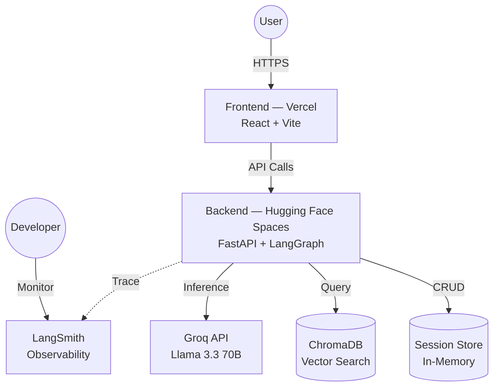
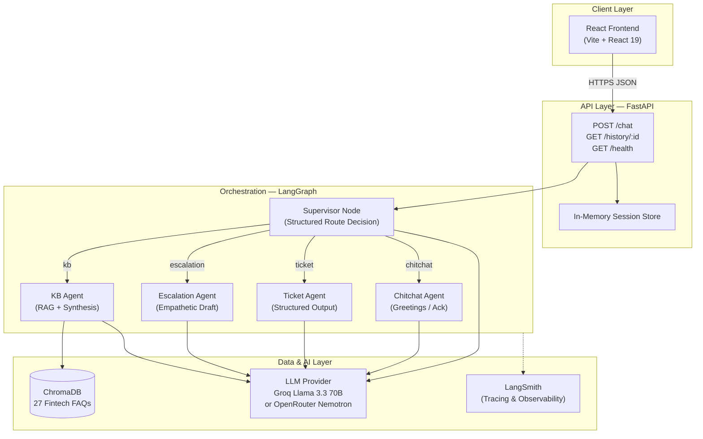
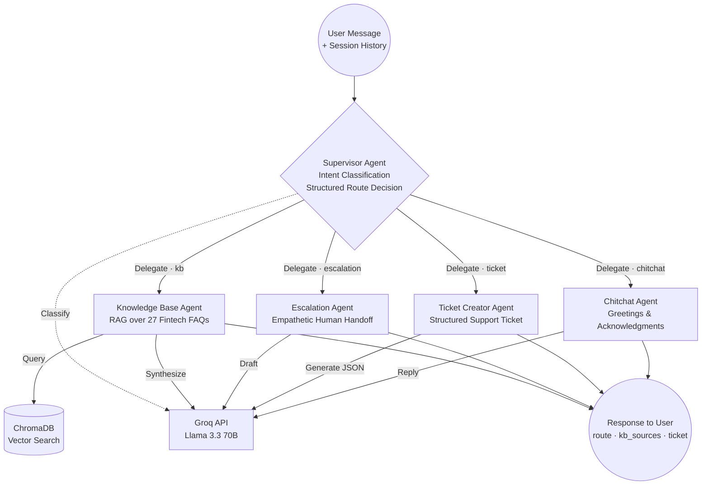
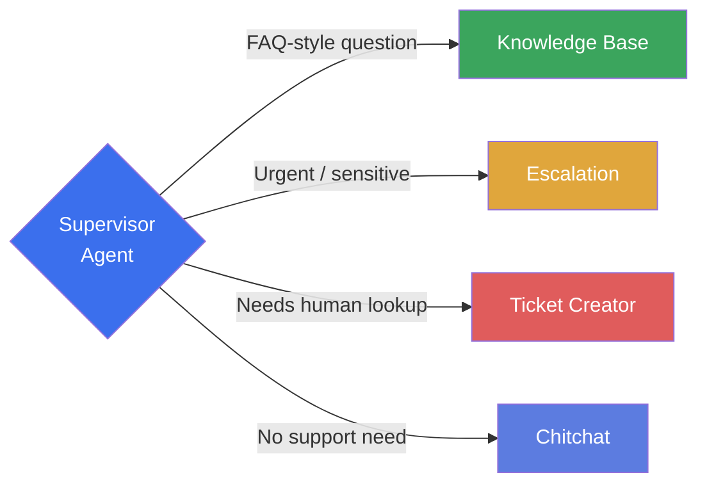
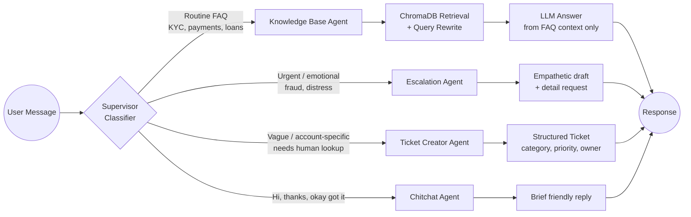
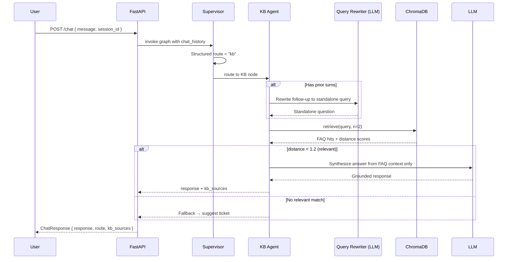
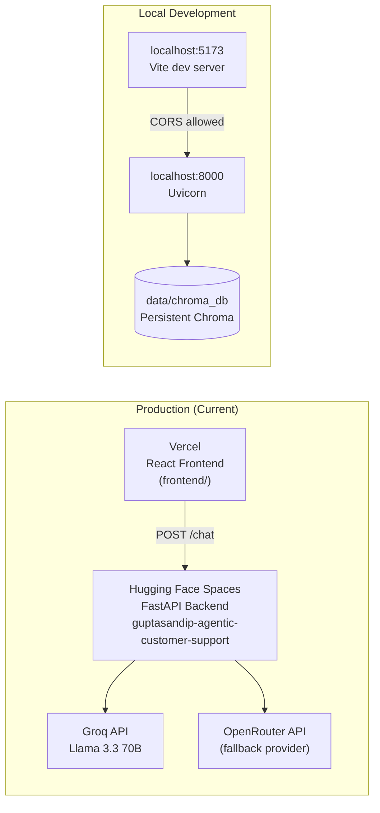

# Agentic Customer Support System

> An end-to-end **multi-agent AI customer support platform** for fintech use cases. A LangGraph supervisor routes each user message to specialized agents — Knowledge Base (RAG), Escalation, Ticket Creator, or Chitchat — backed by FastAPI, ChromaDB, and pluggable LLM providers (Groq / OpenRouter).

[](https://www.python.org/)
[](https://fastapi.tiangolo.com/)
[](https://langchain-ai.github.io/langgraph/)
[](https://react.dev/)
[](https://www.trychroma.com/)
[](LICENSE)

---

## Live Demo

| Service | URL | Status |
|---------|-----|--------|
| **Backend API** | [https://guptasandip-agentic-customer-support.hf.space](https://guptasandip-agentic-customer-support.hf.space) | Live (Hugging Face Spaces) |
| **API Docs (Swagger)** | [https://guptasandip-agentic-customer-support.hf.space/docs](https://guptasandip-agentic-customer-support.hf.space/docs) | Interactive OpenAPI |
| **Health Check** | [https://guptasandip-agentic-customer-support.hf.space/health](https://guptasandip-agentic-customer-support.hf.space/health) | `{"status":"ok"}` |
| **Frontend UI** | _Deploy `frontend/` to Vercel and add your URL here_ | React + Vite |

> **Quick API test**
> ```bash
> curl -X POST https://guptasandip-agentic-customer-support.hf.space/chat \
>   -H "Content-Type: application/json" \
>   -d '{"session_id":"demo-1","message":"How long does KYC verification take?"}'
> ```

**Repository:** [github.com/GuptaSandip/End-to-End-Agentic-Support-System](https://github.com/GuptaSandip/End-to-End-Agentic-Support-System)

---

## Overview

This project demonstrates a **production-style agentic support pipeline** — not a single monolithic chatbot prompt. Every incoming message is:

1. **Classified** by a Supervisor agent using structured LLM output
2. **Routed** to exactly one specialist agent via a LangGraph conditional edge
3. **Handled** with domain-appropriate logic (RAG retrieval, empathy drafting, ticket creation, or casual reply)
4. **Returned** to the client with routing metadata, KB sources, ticket payloads, and latency

The React frontend exposes a **split-panel demo UI**: chat on the left, real-time **Agent Decision** panel on the right (route, latency, KB sources, structured ticket JSON).

### Why this architecture?

| Challenge | Solution in this project |
|-----------|--------------------------|
| Mixed query types (FAQ vs fraud vs vague) | Supervisor + 4 specialized agents |
| Hallucination on factual answers | KB agent answers **only** from retrieved FAQ context |
| Sensitive / emotional issues | Dedicated Escalation agent (empathy, no false promises) |
| Unclassifiable issues | Ticket agent produces structured JSON for human teams |
| Conversation follow-ups | Query rewriting + chat history in supervisor & KB prompts |
| Provider flexibility | `LLM_PROVIDER` env switch (Groq ↔ OpenRouter) |
| Local embeddings cost | ChromaDB default ONNX embeddings (no API key) |

---

## End-to-End Production Flow

High-level view of how users interact with the deployed system — from the browser through the API to data and AI services.



| Layer | Service | Role |
|-------|---------|------|
| **Actors** | User | Chats via the React UI over HTTPS |
| **Actors** | Developer | Reviews agent traces and routing decisions in LangSmith |
| **Application** | Frontend — Vercel | Chat panel + Agent Decision panel; calls `/chat` API |
| **Application** | Backend — Hugging Face Spaces | LangGraph orchestration, session management, RAG pipeline |
| **Data & AI** | Session Store | In-memory turn history per `session_id` (CRUD) |
| **Data & AI** | ChromaDB | Semantic FAQ retrieval for the Knowledge Base agent (Query) |
| **Data & AI** | Groq API | LLM inference for routing, RAG synthesis, and agent replies |
| **Data & AI** | LangSmith | End-to-end agent tracing and observability |

---

## System Architecture



---

## Multi-Agent Architecture

Every user message enters the **Supervisor Agent**, which classifies intent and **delegates** to exactly one specialist agent. The supervisor never answers directly — it routes, then the selected worker handles the request and returns a unified response.



### Agent roles

| Agent | Responsibility | Delegated when… | Key output |
|-------|----------------|-----------------|------------|
| **Supervisor** | Reads query + chat history, picks one route via structured LLM output | Every message (entry point) | `route` → `kb` \| `escalation` \| `ticket` \| `chitchat` |
| **Knowledge Base** | Retrieves relevant FAQs from ChromaDB, rewrites follow-ups, answers only from context | Routine factual questions (KYC, payments, loans, app issues) | Natural-language answer + `kb_sources` |
| **Escalation** | Acknowledges urgency with empathy, gathers critical details, does **not** resolve | Fraud, unauthorized charges, distress, emotionally charged issues | Empathetic escalation message |
| **Ticket Creator** | Creates a structured ticket for human teams when automation can't help | Vague, account-specific, or unclassifiable support needs | User message + `ticket` JSON (category, priority, owner) |
| **Chitchat** | Handles non-support conversation | Greetings, thanks, "okay got it", small talk | Brief friendly reply |

### Delegation logic (Supervisor)



> **LangGraph wiring:** The supervisor is the graph entry point. A conditional edge reads `state.route` and invokes exactly one worker node. Each worker runs to `END` — there is no multi-hop agent chaining in the current design.

---

## Agent Routing Flow



### Route definitions

| Route | Agent | When to use | Output |
|-------|-------|-------------|--------|
| `kb` | Knowledge Base | Factual fintech questions answerable from FAQs | Natural-language answer + `kb_sources` |
| `escalation` | Escalation | Fraud, unauthorized charges, distress, urgency | Empathetic escalation message |
| `ticket` | Ticket Creator | Real support need that doesn't fit KB or escalation | User message + structured `ticket` object |
| `chitchat` | Chitchat | Greetings, thanks, acknowledgments | Short conversational reply |

---

## RAG Pipeline (Knowledge Base Agent)



**Knowledge base:** 27 curated FAQs across `account_kyc`, `payments`, `loans`, and `app_technical` categories in `data/faqs.json`.

---

## Deployment Architecture



| Component | Platform | Notes |
|-----------|----------|-------|
| Backend | [Hugging Face Spaces](https://huggingface.co/spaces) | FastAPI + LangGraph compiled at startup |
| Frontend | [Vercel](https://vercel.com) | Deploy root directory: `frontend/` |
| Vector DB | Local persistent Chroma | Built via `python -m app.rag.build_index` |
| LLM | Groq (default) or OpenRouter | Switch with `LLM_PROVIDER` env var |
| Observability | [LangSmith](https://smith.langchain.com) | Linked from Agent Decision panel in UI |

---

## Tech Stack

### Backend
- **FastAPI** — REST API, CORS, Pydantic models
- **LangGraph** — Stateful multi-agent workflow (`StateGraph`)
- **LangChain** — LLM abstraction, structured output, prompts
- **ChromaDB** — Local vector store with built-in embeddings
- **Groq** — Primary LLM (`llama-3.3-70b-versatile`)
- **OpenRouter** — Secondary LLM (`nvidia/nemotron-3-ultra-550b-a55b:free`)
- **LangSmith** — Agent tracing and debugging

### Frontend
- **React 19** + **Vite 8** — SPA with HMR
- Split UI: `ChatPanel` + `AgentDecisionPanel`
- Latency measurement client-side via `performance.now()`

---

## Project Structure

```
agentic-support-system/
├── app/
│   ├── main.py                 # FastAPI app, /chat, /health, session store
│   ├── llm_provider.py         # Groq / OpenRouter factory
│   ├── graph/
│   │   ├── state.py            # SupportState TypedDict
│   │   ├── supervisor.py       # Route classifier (structured output)
│   │   ├── kb_agent.py         # RAG + grounded answer synthesis
│   │   ├── escalation_agent.py # Empathetic escalation drafts
│   │   ├── ticket_agent.py     # Structured ticket generation
│   │   ├── chitchat_agent.py   # Greetings & acknowledgments
│   │   └── build_graph.py      # LangGraph wiring
│   └── rag/
│       ├── build_index.py      # FAQ → ChromaDB indexer
│       ├── retriever.py        # Chroma query wrapper
│       └── test_retrieval.py   # Retrieval sanity tests
├── data/
│   └── faqs.json               # 27 fintech FAQ entries
├── frontend/
│   ├── src/
│   │   ├── App.jsx             # Main layout
│   │   ├── api.js              # Backend client
│   │   └── components/
│   │       ├── ChatPanel.jsx
│   │       └── AgentDecisionPanel.jsx
│   └── package.json
└── pyproject.toml
```

---

## API Reference

### `GET /health`
Health check endpoint.

**Response:** `{"status": "ok"}`

---

### `POST /chat`
Process a user message through the agent graph.

**Request body:**
```json
{
  "session_id": "demo-session-1",
  "message": "How long does KYC verification take?"
}
```

**Response body:**
```json
{
  "response": "KYC verification typically takes 24-48 hours...",
  "route": "kb",
  "kb_sources": ["account_kyc"],
  "ticket": null
}
```

| Field | Type | Description |
|-------|------|-------------|
| `response` | `string` | Agent-generated reply |
| `route` | `string` | `kb` \| `escalation` \| `ticket` \| `chitchat` |
| `kb_sources` | `string[]` \| `null` | FAQ categories used (KB route only) |
| `ticket` | `object` \| `null` | Structured ticket (ticket route only) |

**Ticket object shape:**
```json
{
  "category": "payments",
  "priority": "high",
  "summary": "User reports failed EMI payment",
  "suggested_owner": "Payments Ops"
}
```

---

### `GET /history/{session_id}`
Returns in-memory conversation history for a session.

---

## Getting Started

### Prerequisites
- Python **3.12+**
- Node.js **18+** (for frontend)
- API key for **Groq** and/or **OpenRouter**

### 1. Clone & install backend

```bash
git clone https://github.com/GuptaSandip/End-to-End-Agentic-Support-System.git
cd End-to-End-Agentic-Support-System

# Create virtual environment
python -m venv .venv
# Windows
.venv\Scripts\activate
# macOS/Linux
source .venv/bin/activate

pip install -e .
```

### 2. Environment variables

Create a `.env` file in the project root:

```env
# LLM provider: "groq" (default) or "openrouter"
LLM_PROVIDER=groq

# Groq (primary)
GROQ_API_KEY=your_groq_api_key

# OpenRouter (fallback / alternative)
OPENROUTER_API_KEY=your_openrouter_api_key

# LangSmith (optional — for tracing)
LANGCHAIN_TRACING_V2=true
LANGCHAIN_API_KEY=your_langsmith_api_key
LANGCHAIN_PROJECT=agentic-support-system
```

### 3. Build the vector index

```bash
python -m app.rag.build_index
```

This indexes `data/faqs.json` into `data/chroma_db/`.

### 4. Run the backend

```bash
uvicorn app.main:app --reload --host 0.0.0.0 --port 8000
```

Verify: [http://localhost:8000/health](http://localhost:8000/health)

### 5. Run the frontend

```bash
cd frontend
npm install
npm run dev
```

Open [http://localhost:5173](http://localhost:5173).

To point at the **live backend**, `frontend/src/api.js` already uses:
```
https://guptasandip-agentic-customer-support.hf.space
```

For local backend development, change `API_BASE` to `http://localhost:8000`.

### 6. Test the agent graph (CLI)

```bash
python -m app.graph.build_graph
```

Runs sample queries and prints route, response, KB sources, and ticket output.

### 7. Test retrieval quality

```bash
python -m app.rag.test_retrieval
```

---

## Demo Queries

Try these in the chat UI to see different agents in action:

| Query | Expected Route | What to observe |
|-------|----------------|-----------------|
| _"How long does KYC verification take?"_ | `kb` | Grounded FAQ answer + `kb_sources` |
| _"Someone made an unauthorized transaction on my account, I'm panicking"_ | `escalation` | Empathetic tone, asks for transaction details |
| _"My EMI payment failed, what happens now?"_ | `kb` or `ticket` | FAQ match or structured ticket |
| _"asdkjasd random gibberish issue"_ | `ticket` | Ticket JSON with category & priority |
| _"Thanks, that helps!"_ | `chitchat` | Brief friendly closing reply |

---

## Frontend Deployment (Vercel)

1. Push the repo to GitHub
2. Import the project in [Vercel](https://vercel.com/new)
3. Set **Root Directory** to `frontend`
4. Build command: `npm run build` · Output: `dist`
5. Ensure `frontend/src/api.js` points to your production backend URL
6. Add your live frontend URL to the **Live Demo** table at the top of this README

---

## Backend Deployment (Hugging Face Spaces)

The production API runs on Hugging Face Spaces as a Dockerized FastAPI app:

- **Space:** [guptasandip/agentic-customer-support](https://huggingface.co/spaces/guptasandip/agentic-customer-support) _(if public)_
- **Endpoint:** `https://guptasandip-agentic-customer-support.hf.space`

Required Space secrets: `GROQ_API_KEY`, `LLM_PROVIDER`, and optionally LangSmith keys.

---

## Design Decisions

### Structured routing vs. free-text
The supervisor uses `with_structured_output(RouteDecision)` so routing is **typed and auditable** — not buried in prose. This powers the frontend Agent Decision panel and LangSmith traces.

### Query rewriting before retrieval
Follow-up messages like _"what about that?"_ are rewritten into standalone questions before ChromaDB search, improving RAG recall on multi-turn conversations.

### Distance threshold filtering
KB hits with `distance >= 1.2` are discarded to avoid answering from weak matches. The agent falls back to suggesting a ticket instead of hallucinating.

### In-memory sessions
`session_store` in `main.py` keeps the last 4 turns per `session_id` for demo purposes. For production, swap to Redis or PostgreSQL.

### Provider abstraction
`get_llm()` in `llm_provider.py` exposes a single LangChain interface — graph code never branches on provider.

---

## Roadmap

- [ ] Persist sessions in Redis / PostgreSQL
- [ ] Add `VITE_API_BASE` env var for frontend (avoid hardcoded API URL)
- [ ] Expand FAQ corpus and add evaluation suite (routing accuracy, RAG faithfulness)
- [ ] Wire LangSmith trace IDs into the Agent Decision panel
- [ ] Add authentication and rate limiting on `/chat`
- [ ] Human-in-the-loop escalation queue for `escalation` route
- [ ] Streaming responses (SSE) for lower perceived latency

---

## Author

**Sandip Gupta** — AI Engineer  
Building production-grade LLM systems: Agentic AI · RAG · LangGraph · Computer Vision

- GitHub: [@GuptaSandip](https://github.com/GuptaSandip)
- Portfolio: [sandipgupta.is-a.dev](https://sandipgupta.is-a.dev/)
- Organization: Edunet Foundation

---

## License

MIT License — see [LICENSE](LICENSE) for details.
